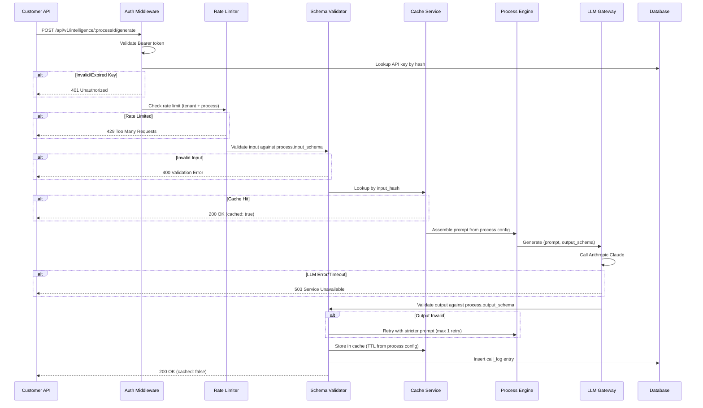

# Architecture

## Executive Summary

The Product Intelligence Layer is a multi-tenant SaaS platform enabling companies to convert product metadata into private, schema-constrained intelligence APIs. Built on the T3 stack (Next.js, tRPC, Prisma, NextAuth), the architecture prioritizes type safety, tenant isolation, and cost efficiency. The system uses PostgreSQL as the single data store for MVP, with abstraction layers enabling future upgrades to Redis caching and additional LLM providers.

## Project Initialization

First implementation story should execute:

```bash
npx create-t3-app@7.40.0 product-intelligence-layer --dbProvider postgres
```

This establishes the base architecture with:
- Next.js 15.5.x (App Router)
- TypeScript 5.9.x
- Tailwind CSS 4.x
- tRPC 11.x (type-safe APIs)
- Prisma ORM 7.x
- NextAuth.js 5.x (Auth.js)

## Decision Summary

> **Version Verification Date:** 2025-11-25

| Category | Decision | Version | Rationale |
|----------|----------|---------|-----------|
| Framework | Next.js (App Router) † | 15.5.x | T3 default, SSR/SSG support |
| Language | TypeScript † | 5.9.x | Type safety across stack |
| Styling | Tailwind CSS † | 4.x | T3 default, utility-first, v4 rewrite |
| UI Components | shadcn/ui | CLI latest | Copy-paste, Tailwind-native |
| API (Internal) | tRPC † | 11.4.x | End-to-end type safety |
| API (Public) | REST | - | Customer integrations |
| ORM | Prisma † | 7.x | Type-safe DB access, Rust-free |
| Database | PostgreSQL | 16.x | Local (Homebrew) or Railway |
| Auth | NextAuth.js (Auth.js) † | 5.x (beta) | T3 default, flexible |
| LLM Provider | Anthropic Claude | - | Provider-agnostic gateway |
| Caching | PostgreSQL-based | - | MVP cost efficiency |
| Background Jobs | pg-boss | 12.3.x | PostgreSQL-based, free |
| Workflows | N8N | - | External, existing tool |
| Rate Limiting | PostgreSQL-based | - | MVP cost efficiency |
| Testing (Unit) | Vitest | 4.x | Fast, ESM-native, browser mode |
| Testing (E2E) | Playwright | 1.56.x | Cross-browser, free |
| Hosting | Railway | - | Managed PostgreSQL included |
| Monitoring | Railway built-in | - | Logs, metrics, alerts |
| Node.js | LTS | 20.x | Required minimum |
| Package Manager | pnpm † | 9.x | T3 recommended |

**Notes:**
- † = Provided by create-t3-app starter template
- Versions marked with `.x` will resolve to latest patch at install time (e.g., 15.5.x → 15.5.3)
- shadcn/ui uses CLI installation (`npx shadcn@latest`), not npm dependency
- NextAuth.js v5 is rebranded as Auth.js and still in beta; test thoroughly
- Prisma 7 removes Rust dependency for 90% smaller bundles

## Project Structure

```
product-intelligence-layer/
├── src/
│   ├── app/                      # Next.js App Router
│   │   ├── (auth)/               # Auth routes (login, signup)
│   │   ├── (dashboard)/          # Protected dashboard routes
│   │   │   ├── processes/        # Process management UI
│   │   │   ├── api-keys/         # API key management
│   │   │   ├── logs/             # Call history viewer
│   │   │   └── settings/         # Tenant settings
│   │   ├── api/                  # API routes
│   │   │   └── v1/
│   │   │       └── intelligence/ # Public intelligence endpoints
│   │   └── layout.tsx
│   │
│   ├── server/                   # Backend logic
│   │   ├── api/
│   │   │   └── routers/          # tRPC routers
│   │   │       ├── process.ts    # Process CRUD
│   │   │       ├── apiKey.ts     # Key management
│   │   │       ├── logs.ts       # Log queries
│   │   │       └── tenant.ts     # Tenant management
│   │   ├── services/             # Business logic
│   │   │   ├── llm/              # LLM Gateway (provider-agnostic)
│   │   │   │   ├── gateway.ts    # Main interface
│   │   │   │   ├── anthropic.ts  # Claude adapter
│   │   │   │   └── types.ts      # Shared types
│   │   │   ├── process/          # Process generation engine
│   │   │   ├── cache/            # Response caching
│   │   │   ├── rateLimit/        # Rate limiting
│   │   │   └── schema/           # Schema validation
│   │   ├── jobs/                 # pg-boss job definitions
│   │   └── db/                   # Database utilities
│   │
│   ├── components/               # React components (shadcn/ui)
│   │   ├── ui/                   # Base shadcn components
│   │   ├── dashboard/            # Dashboard-specific
│   │   ├── process/              # Process builder UI
│   │   └── common/               # Shared components
│   │
│   ├── lib/                      # Shared utilities
│   │   ├── utils.ts              # General helpers
│   │   ├── logger.ts             # Structured logging
│   │   ├── errors.ts             # Error types & handling
│   │   └── id.ts                 # ID generation (prefixed)
│   │
│   └── types/                    # Shared TypeScript types
│
├── prisma/
│   └── schema.prisma             # Database schema
│
├── tests/
│   ├── unit/                     # Vitest unit tests
│   ├── integration/              # Vitest integration tests
│   └── e2e/                      # Playwright E2E tests
│
├── .env.example
├── package.json
└── README.md
```

## Technology Stack Details

### Core Technologies

**Next.js 15 (App Router)**
- Server Components by default
- Route groups for auth/dashboard separation
- API routes for public intelligence endpoints

**tRPC**
- End-to-end type safety between frontend and backend
- Used for all internal dashboard operations
- NOT used for public customer-facing APIs (REST instead)

**Prisma + PostgreSQL**
- Type-safe database access
- Migrations managed via Prisma
- PostgreSQL: local (Homebrew) for development, Railway for production

**NextAuth.js**
- Session-based authentication
- Extensible for OAuth providers
- Tenant association on user records

### Integration Points

**LLM Gateway**
- Provider-agnostic interface in `src/server/services/llm/`
- Anthropic Claude as primary provider
- Adapter pattern allows adding OpenAI, local models, etc.

```typescript
// src/server/services/llm/gateway.ts
interface LLMGateway {
  generate(params: GenerateParams): Promise<GenerateResult>;
}

// Easy to swap providers
const gateway = createAnthropicGateway(config);
// Future: createOpenAIGateway(config);
```

**N8N Integration**
- Stripe webhook → N8N → Welcome email
- Notification workflows managed externally
- No email service in application code

**pg-boss**
- PostgreSQL-based job queue
- Handles: cache cleanup, metrics aggregation, log exports
- Jobs defined in `src/server/jobs/`

## Intelligence Generation Flow (Novel Pattern)

This section documents the core product pattern: converting customer product metadata into schema-constrained intelligence via LLM. This is the primary value proposition and must be implemented consistently.

### Flow Overview

```
Customer Request → API Key Auth → Rate Limit Check → Input Validation
    → Cache Lookup → [HIT: Return Cached] / [MISS: Continue]
    → Prompt Assembly → LLM Gateway → Output Validation
    → Cache Store → Log Entry → Response
```

### Sequence Diagram



### Component Responsibilities

| Component | Location | Responsibility |
|-----------|----------|----------------|
| Auth Middleware | `src/app/api/v1/intelligence/[processId]/route.ts` | Validate Bearer token, extract tenant context |
| Rate Limiter | `src/server/services/rateLimit/` | Check per-tenant and per-process limits |
| Schema Validator | `src/server/services/schema/` | Validate input/output against Zod schemas |
| Cache Service | `src/server/services/cache/` | Hash-based lookup and storage with TTL |
| Process Engine | `src/server/services/process/` | Load process config, assemble LLM prompt |
| LLM Gateway | `src/server/services/llm/` | Provider-agnostic LLM invocation |

### Input Hash Calculation

Cache keys are deterministic hashes of the input:

```typescript
// src/server/services/cache/hash.ts
import { createHash } from "crypto";

export function computeInputHash(
  tenantId: string,
  processId: string,
  input: Record<string, unknown>
): string {
  const normalized = JSON.stringify(input, Object.keys(input).sort());
  const payload = `${tenantId}:${processId}:${normalized}`;
  return createHash("sha256").update(payload).digest("hex").slice(0, 32);
}
```

### Prompt Assembly

The Process Engine assembles prompts from process configuration:

```typescript
// src/server/services/process/prompt.ts
export function assemblePrompt(
  processVersion: ProcessVersion,
  input: Record<string, unknown>
): string {
  const { config } = processVersion;

  return `${config.systemPrompt}

Input Data:
${JSON.stringify(input, null, 2)}

Output Requirements:
- Respond ONLY with valid JSON matching this schema
- Schema: ${JSON.stringify(config.outputSchemaDescription)}
- Do not include explanations or markdown formatting

${config.additionalInstructions ?? ""}`;
}
```

### Output Validation & Retry

Output must match the process's output_schema:

```typescript
// src/server/services/schema/validate-output.ts
export async function validateAndRetry(
  gateway: LLMGateway,
  processVersion: ProcessVersion,
  input: Record<string, unknown>,
  rawOutput: string,
  attempt: number = 1
): Promise<ValidatedOutput> {
  const outputSchema = zodSchemaFromJson(processVersion.output_schema);

  try {
    const parsed = JSON.parse(rawOutput);
    return { data: outputSchema.parse(parsed), retried: attempt > 1 };
  } catch (error) {
    if (attempt >= 2) {
      throw new ProcessError("OUTPUT_VALIDATION_FAILED", {
        message: "LLM output did not match schema after retry",
        zodError: error instanceof ZodError ? error.flatten() : undefined,
      });
    }

    // Retry with stricter prompt
    const stricterPrompt = assemblePrompt(processVersion, input) +
      "\n\nPREVIOUS ATTEMPT FAILED VALIDATION. Ensure output is EXACTLY valid JSON.";

    const retryOutput = await gateway.generate({
      prompt: stricterPrompt,
      maxTokens: processVersion.config.maxTokens,
    });

    return validateAndRetry(gateway, processVersion, input, retryOutput.text, attempt + 1);
  }
}
```

### Error Handling Matrix

| Error Type | HTTP Status | Error Code | Retry? | User Message |
|------------|-------------|------------|--------|--------------|
| Invalid API key | 401 | `UNAUTHORIZED` | No | "Invalid or expired API key" |
| Key lacks scope | 403 | `FORBIDDEN` | No | "API key does not have access to this process" |
| Process not found | 404 | `NOT_FOUND` | No | "Process not found" |
| Input validation failed | 400 | `VALIDATION_ERROR` | No | "Input does not match schema: {details}" |
| Rate limit exceeded | 429 | `RATE_LIMITED` | Yes (after reset) | "Rate limit exceeded. Retry after {reset_time}" |
| LLM timeout | 503 | `LLM_TIMEOUT` | Yes (1x auto) | "Intelligence generation timed out" |
| LLM provider error | 503 | `LLM_ERROR` | Yes (1x auto) | "Intelligence service temporarily unavailable" |
| Output validation failed | 500 | `OUTPUT_VALIDATION_FAILED` | No | "Failed to generate valid response" |
| Cache write failed | N/A | N/A | N/A | (silent, response still returned) |

### Process Version Lifecycle

```
                    ┌──────────────┐
                    │   CREATED    │
                    │  (draft)     │
                    └──────┬───────┘
                           │ publish to sandbox
                           ▼
                    ┌──────────────┐
         edit ────► │   SANDBOX    │ ◄──── test
                    │  (testing)   │
                    └──────┬───────┘
                           │ promote to production
                           ▼
                    ┌──────────────┐
                    │  PRODUCTION  │ ◄──── customer traffic
                    │   (live)     │
                    └──────┬───────┘
                           │ new version published
                           ▼
                    ┌──────────────┐
                    │  DEPRECATED  │
                    │  (read-only) │
                    └──────────────┘
```

**State Rules:**
- Only ONE version per process can be `PRODUCTION` at a time
- `SANDBOX` versions are only accessible with sandbox API keys
- `DEPRECATED` versions continue serving requests but cannot be edited
- Promoting to production automatically deprecates the previous production version

### Configuration Options per Process

```typescript
// Stored in process_versions.config JSON column
interface ProcessConfig {
  // LLM Settings
  systemPrompt: string;           // Base prompt for all requests
  additionalInstructions?: string; // Optional per-process instructions
  maxTokens: number;              // Max response tokens (default: 1024)
  temperature: number;            // LLM temperature (default: 0.3)

  // Caching
  cacheTtlSeconds: number;        // Cache TTL (default: 900 = 15 min)
  cacheEnabled: boolean;          // Can disable caching (default: true)

  // Rate Limiting
  requestsPerMinute: number;      // Per-process limit (default: 60)

  // Retry Behavior
  llmTimeoutMs: number;           // Timeout for LLM call (default: 30000)
  retryOnTimeout: boolean;        // Auto-retry on timeout (default: true)
}
```

### Implementation Checklist for Agents

When implementing the intelligence generation flow, ensure:

- [ ] API route extracts `processId` from URL params
- [ ] Bearer token is validated against `api_keys.key_hash`
- [ ] Tenant context is set from API key's `tenant_id`
- [ ] Rate limit check uses sliding window on `rate_limits` table
- [ ] Input is validated against `processes.input_schema` using Zod
- [ ] Cache lookup uses `computeInputHash()` function
- [ ] Process version is loaded based on API key's environment scope
- [ ] Prompt is assembled using `assemblePrompt()` pattern
- [ ] LLM call goes through `LLMGateway.generate()` abstraction
- [ ] Output is validated against `processes.output_schema`
- [ ] Failed output validation triggers ONE retry with stricter prompt
- [ ] Successful response is cached with TTL from process config
- [ ] `call_logs` entry is created for ALL requests (success and failure)
- [ ] Response includes `meta.cached`, `meta.latency_ms`, `meta.request_id`
- [ ] All errors use standard error response format

## Implementation Patterns

### Naming Conventions

| Element | Convention | Example |
|---------|------------|---------|
| Files | kebab-case | `api-key.ts`, `rate-limit.ts` |
| React Components | PascalCase | `ProcessBuilder.tsx` |
| Functions/Variables | camelCase | `generateProcess()`, `tenantId` |
| Database Tables | snake_case (plural) | `processes`, `api_keys` |
| Database Columns | snake_case | `tenant_id`, `created_at` |
| tRPC Routers | camelCase | `process.create`, `apiKey.revoke` |
| API Endpoints | kebab-case (plural) | `/api/v1/intelligence/:id/generate` |
| Environment Variables | SCREAMING_SNAKE | `DATABASE_URL`, `ANTHROPIC_API_KEY` |

### ID Format

All entity IDs use prefixed format for self-documenting logs:

| Entity | Prefix | Example |
|--------|--------|---------|
| Tenant | `ten_` | `ten_abc123` |
| User | `usr_` | `usr_xyz789` |
| Process | `proc_` | `proc_def456` |
| Process Version | `procv_` | `procv_ghi012` |
| API Key | `key_` | `key_jkl345` |
| Request | `req_` | `req_mno678` |

### Code Organization

- One component per file
- Co-locate tests: `process.ts` → `process.test.ts`
- Use `index.ts` for folder public API
- Keep types with implementation unless shared

### Import Order

```typescript
// 1. External packages
import { z } from "zod";
import { TRPCError } from "@trpc/server";

// 2. Internal aliases (@/)
import { db } from "@/server/db";
import { generateId } from "@/lib/id";

// 3. Relative imports
import { validateSchema } from "./schema";
import type { ProcessConfig } from "./types";
```

### Database Patterns

- **Primary keys:** `id` (prefixed string)
- **Foreign keys:** `{table}_id` (e.g., `tenant_id`)
- **Timestamps:** `created_at`, `updated_at` (auto-managed)
- **Soft deletes:** `deleted_at` (nullable timestamp)
- **JSON columns:** For flexible schema (`input_schema`, `output_schema`)
- **Enums:** Prisma enums for fixed values (`Environment.SANDBOX`)

### tRPC Patterns

```typescript
export const processRouter = createTRPCRouter({
  create: protectedProcedure
    .input(createProcessSchema)
    .mutation(({ ctx, input }) => { ... }),

  get: protectedProcedure
    .input(z.object({ id: z.string() }))
    .query(({ ctx, input }) => { ... }),
});
```

- Resource-based router naming
- Always use Zod for input validation
- Throw `TRPCError` with appropriate codes
- Use `protectedProcedure` for authenticated routes

### Permission Checking Patterns

**Dashboard (tRPC) - Tenant Isolation:**

```typescript
// src/server/api/trpc.ts
export const protectedProcedure = t.procedure
  .use(({ ctx, next }) => {
    if (!ctx.session?.user) {
      throw new TRPCError({ code: "UNAUTHORIZED" });
    }
    return next({
      ctx: {
        session: ctx.session,
        tenantId: ctx.session.user.tenantId, // Always set from session
      },
    });
  });

// src/server/api/routers/process.ts
export const processRouter = createTRPCRouter({
  get: protectedProcedure
    .input(z.object({ id: z.string() }))
    .query(async ({ ctx, input }) => {
      const process = await ctx.db.process.findFirst({
        where: {
          id: input.id,
          tenantId: ctx.tenantId, // ALWAYS filter by tenant
          deletedAt: null,
        },
      });

      if (!process) {
        throw new TRPCError({ code: "NOT_FOUND" });
      }

      return process;
    }),
});
```

**Public API - API Key Scope Validation:**

```typescript
// src/server/services/auth/api-key.ts
import { createHash } from "crypto";

interface ApiKeyContext {
  tenantId: string;
  keyId: string;
  scopes: string[];        // e.g., ["process:proc_abc123", "process:*"]
  environment: "SANDBOX" | "PRODUCTION";
}

export async function validateApiKey(
  authHeader: string | null
): Promise<ApiKeyContext> {
  if (!authHeader?.startsWith("Bearer ")) {
    throw new ApiError("UNAUTHORIZED", "Missing or invalid Authorization header");
  }

  const token = authHeader.slice(7);
  const keyHash = createHash("sha256").update(token).digest("hex");

  const apiKey = await db.apiKey.findFirst({
    where: {
      keyHash,
      revokedAt: null,
      OR: [
        { expiresAt: null },
        { expiresAt: { gt: new Date() } },
      ],
    },
  });

  if (!apiKey) {
    throw new ApiError("UNAUTHORIZED", "Invalid or expired API key");
  }

  // Update last used timestamp (fire-and-forget)
  db.apiKey.update({
    where: { id: apiKey.id },
    data: { lastUsedAt: new Date() },
  }).catch(() => {}); // Silent failure OK

  return {
    tenantId: apiKey.tenantId,
    keyId: apiKey.id,
    scopes: apiKey.scopes as string[],
    environment: apiKey.environment as "SANDBOX" | "PRODUCTION",
  };
}

export function assertProcessAccess(
  ctx: ApiKeyContext,
  processId: string
): void {
  const hasWildcard = ctx.scopes.includes("process:*");
  const hasSpecific = ctx.scopes.includes(`process:${processId}`);

  if (!hasWildcard && !hasSpecific) {
    throw new ApiError("FORBIDDEN", "API key does not have access to this process");
  }
}
```

**Usage in API Route:**

```typescript
// src/app/api/v1/intelligence/[processId]/generate/route.ts
import { validateApiKey, assertProcessAccess } from "@/server/services/auth/api-key";

export async function POST(
  request: Request,
  { params }: { params: { processId: string } }
) {
  // 1. Authenticate
  const ctx = await validateApiKey(request.headers.get("Authorization"));

  // 2. Authorize - check process scope
  assertProcessAccess(ctx, params.processId);

  // 3. Load process version matching key's environment
  const processVersion = await db.processVersion.findFirst({
    where: {
      process: {
        id: params.processId,
        tenantId: ctx.tenantId, // ALWAYS filter by tenant
        deletedAt: null,
      },
      environment: ctx.environment, // SANDBOX or PRODUCTION based on key
      deprecatedAt: null,
    },
    orderBy: { publishedAt: "desc" },
  });

  if (!processVersion) {
    throw new ApiError("NOT_FOUND", "Process not found or not published");
  }

  // 4. Continue with generation flow...
}
```

**Key Security Rules:**
- NEVER trust client-provided `tenantId` - always derive from session or API key
- ALWAYS include `tenantId` in WHERE clauses for all database queries
- API key scopes use format: `process:*` (all) or `process:proc_abc123` (specific)
- Environment is tied to API key, not request - prevents sandbox keys hitting production

### Public API Patterns

```
POST /api/v1/intelligence/:processId/generate
GET  /api/v1/intelligence/:processId/schema
GET  /api/v1/intelligence/:processId/versions
```

- URL-based versioning (`/v1/`, `/v2/`)
- Bearer token authentication
- Rate limit headers: `X-RateLimit-Limit`, `X-RateLimit-Remaining`, `X-RateLimit-Reset`
- Request ID in all responses: `X-Request-Id`
- Content-Type: always `application/json`

## Consistency Rules

### Error Handling

**Error Response Format:**
```typescript
{
  success: false,
  error: {
    code: "VALIDATION_ERROR",
    message: "Human-readable message",
    details: { field: "specific_field", issue: "..." }
  }
}
```

**Success Response Format:**
```typescript
{
  success: true,
  data: { ... },
  meta: {
    version: "1.0.0",
    cached: true,
    latency_ms: 245,
    request_id: "req_abc123"
  }
}
```

### Date/Time Handling

- **Storage:** UTC timestamps (`timestamptz` in PostgreSQL)
- **API responses:** ISO 8601 strings (`2025-11-24T15:30:00Z`)
- **Display:** Convert to user timezone in frontend only

### Logging Strategy

**Standard Logs:**
```json
{
  "timestamp": "2025-11-24T15:30:00.123Z",
  "level": "info",
  "message": "Process executed",
  "service": "api-generation",
  "request_id": "req_abc123",
  "tenant_id": "ten_xyz789",
  "process_id": "proc_def456",
  "process_version_id": "procv_ghi012"
}
```

**Error Logs (Rich Context):**
```json
{
  "timestamp": "2025-11-24T15:30:00.123Z",
  "level": "error",
  "service": "api-generation",
  "request_id": "req_abc123",
  "tenant_id": "ten_xyz789",
  "user_id": "usr_abc456",
  "process_id": "proc_def456",
  "process_version_id": "procv_ghi012",
  "endpoint_version": "1.0.0",
  "environment": "production",
  "error_code": "LLM_TIMEOUT",
  "error_message": "Claude API timed out after 30000ms",
  "error_stack": "Error: LLM_TIMEOUT\n    at generateIntelligence...",
  "error_category": "upstream",
  "http_method": "POST",
  "http_path": "/api/intelligence/proc_def456/generate",
  "http_status": 503,
  "content_length": 1250,
  "user_agent": "axios/1.6.0",
  "referer": "https://customer-erp.com",
  "duration_ms": 30125,
  "llm_duration_ms": 30000,
  "cache_checked": true,
  "cache_hit": false,
  "input_field_count": 12,
  "input_byte_size": 1250,
  "input_schema_valid": true,
  "input_hash": "sha256:abc123...",
  "memory_usage_mb": 245,
  "active_requests": 47,
  "retry_attempt": 0
}
```

**Privacy-Safe Logging:**
- No actual input content (customer product data)
- No LLM prompts or responses
- No IP addresses
- No API keys or tokens
- No PII from customer data

## Data Architecture

### Core Entities

```
tenants
├── id (ten_*)
├── name
├── created_at
├── updated_at
└── deleted_at

users
├── id (usr_*)
├── tenant_id → tenants
├── email
├── name
├── created_at
└── updated_at

processes
├── id (proc_*)
├── tenant_id → tenants
├── name
├── description
├── input_schema (JSON)
├── output_schema (JSON)
├── created_at
├── updated_at
└── deleted_at

process_versions
├── id (procv_*)
├── process_id → processes
├── version (semver)
├── config (JSON)
├── environment (SANDBOX | PRODUCTION)
├── published_at
├── created_at
└── deprecated_at

api_keys
├── id (key_*)
├── tenant_id → tenants
├── name
├── key_hash
├── scopes (JSON)
├── expires_at
├── created_at
├── revoked_at
└── last_used_at

call_logs
├── id (req_*)
├── tenant_id → tenants
├── process_id → processes
├── process_version_id → process_versions
├── input_hash
├── output (JSON)
├── latency_ms
├── cached
├── error_code
├── created_at

response_cache
├── id
├── tenant_id → tenants
├── process_id → processes
├── input_hash (indexed)
├── response (JSON)
├── expires_at (indexed)
├── created_at

rate_limits
├── id
├── tenant_id → tenants
├── process_id → processes (nullable)
├── window_start
├── request_count
├── created_at
```

## API Contracts

### Public Intelligence API

**Generate Intelligence**
```
POST /api/v1/intelligence/:processId/generate
Authorization: Bearer key_abc123

Request:
{
  "input": { ... }  // Matches process input_schema
}

Response (Success):
{
  "success": true,
  "data": { ... },  // Matches process output_schema
  "meta": {
    "version": "1.0.0",
    "cached": false,
    "latency_ms": 1245,
    "request_id": "req_xyz789"
  }
}

Response (Error):
{
  "success": false,
  "error": {
    "code": "VALIDATION_ERROR",
    "message": "Invalid input: missing required field 'product_name'",
    "details": { "field": "product_name", "issue": "required" }
  }
}
```

**HTTP Status Codes:**
- `200` - Success
- `400` - Invalid input (schema validation failed)
- `401` - Unauthorized (invalid/missing API key)
- `403` - Forbidden (key doesn't have access to this process)
- `404` - Process not found
- `429` - Rate limit exceeded
- `503` - LLM provider unavailable

### Rate Limit Headers

All responses include:
```
X-RateLimit-Limit: 100
X-RateLimit-Remaining: 95
X-RateLimit-Reset: 1732470600
X-Request-Id: req_abc123
```

## Security Architecture

### Authentication

**Dashboard (NextAuth.js):**
- Session-based authentication
- Secure HTTP-only cookies
- CSRF protection built-in

**Public API:**
- Bearer tokens in `Authorization` header
- Tokens scoped per-process or tenant-wide
- 90-day default expiration with rotation support
- Immediate revocation via dashboard

### Tenant Isolation

- All database queries filtered by `tenant_id`
- Prisma middleware enforces tenant context
- API keys tied to specific tenant
- No cross-tenant data access possible

### Data Protection

- Encryption at rest (Railway PostgreSQL)
- Encryption in transit (TLS)
- API keys stored as hashes (never plaintext)
- Sensitive config encrypted per-tenant

## Performance Considerations

### Response Time Targets (from PRD)

- P95 < 2 seconds
- P99 < 5 seconds

### Caching Strategy

- Response cache in PostgreSQL with TTL (default 15 min)
- Cache key: `tenant_id + process_id + input_hash`
- Cache bypass via `Cache-Control: no-cache` header
- pg-boss job cleans expired entries hourly

### Rate Limiting

- Per-endpoint limits (requests per minute)
- Tenant-level monthly quotas
- Stored in PostgreSQL `rate_limits` table
- Sliding window algorithm

### Database Optimization

- Indexes on: `tenant_id`, `process_id`, `input_hash`, `expires_at`
- Connection pooling via Prisma
- Query optimization for call_logs (90-day retention)

## Deployment Architecture

### Railway Setup

```
Railway Project
├── Web Service (Next.js app)
│   ├── Dockerfile or Nixpacks
│   ├── Environment variables
│   └── Auto-deploy from main branch
│
└── PostgreSQL Database
    ├── Managed backups
    └── Connection pooling
```

### Environment Variables

```bash
# Database
DATABASE_URL="postgresql://..."

# Auth
NEXTAUTH_SECRET="..."
NEXTAUTH_URL="https://app.example.com"

# LLM
ANTHROPIC_API_KEY="..."

# App
NODE_ENV="production"
```

### CI/CD

- Push to `main` → Railway auto-deploy
- Prisma migrations run on deploy
- Vitest runs in GitHub Actions
- Playwright E2E in staging environment

## Development Environment

### Prerequisites

- Node.js 20.x LTS (minimum 20.0.0)
- pnpm 9.x
- PostgreSQL 16.x (local via Homebrew or Railway)

### Local PostgreSQL Setup (macOS)

For local development, PostgreSQL is installed via Homebrew:

```bash
# Install PostgreSQL 16
brew install postgresql@16

# Start service
brew services start postgresql@16

# Create database
/opt/homebrew/opt/postgresql@16/bin/createdb product-intelligence-layer

# Connection string format
DATABASE_URL="postgresql://YOUR_USERNAME@localhost:5432/product-intelligence-layer"
```

**Note:** Local PostgreSQL is not accessible to CI/CD pipelines. For CI/CD and production, use Railway PostgreSQL. See `database-debt.md` for current local service configuration.

### Setup Commands

```bash
# Clone and install
git clone <repo>
cd product-intelligence-layer
pnpm install

# Setup database
cp .env.example .env.local
# Edit .env.local with your DATABASE_URL
pnpm prisma db push

# Run development server
pnpm dev

# Run tests
pnpm test        # Vitest
pnpm test:e2e    # Playwright
```

## Architecture Decision Records (ADRs)

### ADR-001: PostgreSQL for Caching (MVP)

**Context:** Need response caching with TTL for idempotency.

**Decision:** Use PostgreSQL table instead of Redis for MVP.

**Rationale:**
- Zero additional infrastructure cost
- Simpler deployment (one database)
- Adequate performance at early scale
- Abstraction layer allows Redis upgrade later

**Consequences:** May need Redis at high scale; cache cleanup requires pg-boss job.

---

### ADR-002: Provider-Agnostic LLM Gateway

**Context:** Starting with Anthropic Claude, may need other providers later.

**Decision:** Implement adapter pattern in `src/server/services/llm/`.

**Rationale:**
- Avoid vendor lock-in
- Easy to add OpenAI, local models, etc.
- Single interface for all LLM operations

**Consequences:** Slight abstraction overhead; must maintain interface compatibility.

---

### ADR-003: tRPC for Internal, REST for Public

**Context:** Need APIs for both dashboard and customer integrations.

**Decision:** tRPC for dashboard, REST for public intelligence endpoints.

**Rationale:**
- tRPC provides excellent DX and type safety for internal use
- REST is universal for customer integrations (any language/platform)
- Customers expect standard REST APIs with OpenAPI docs

**Consequences:** Two API patterns to maintain; clear separation of concerns.

---

### ADR-004: pg-boss for Background Jobs

**Context:** Need async processing without additional infrastructure.

**Decision:** Use pg-boss (PostgreSQL-based job queue).

**Rationale:**
- Free, open source
- Uses existing PostgreSQL database
- Sufficient for MVP job volumes
- BullMQ available as upgrade path (requires Redis)

**Consequences:** Job throughput limited by PostgreSQL; adequate for MVP.

---

### ADR-005: N8N for Email Workflows

**Context:** Need transactional emails (signup, notifications).

**Decision:** Handle all email via N8N workflows, not in-app.

**Rationale:**
- Already using N8N
- Visual workflow management
- No email service integration in codebase
- Easier to modify without deployments

**Consequences:** Email logic lives outside the app; Stripe webhook integration required.

---

_Generated by BMAD Decision Architecture Workflow v1.3.2_
_Date: 2025-11-24_
_Version Verification: 2025-11-25_
_For: Zac_
